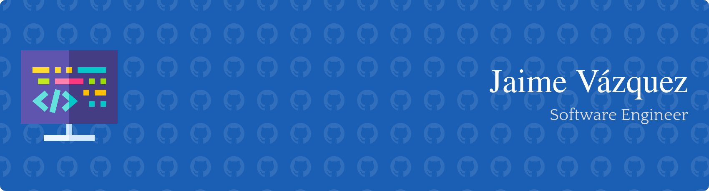

## About Me

Hi there! I'm Jaime, a software engineer with a deep passion for programming and continuous learning. I thrive on solving complex problems and am constantly working on various projects to sharpen my skills and explore new technologies.

### What I Do

- **Programming:** I have experience with multiple programming languages, including Kotlin, Java, Rust, and C++. I enjoy both frontend and backend development and have worked on several full-stack projects.
- **Android engineering:** My main focus for the past few years has been android development. I've built and contributed to several Android applications, as well as more android SDK oriented projects, honing my skills in android development. I've found in android programming lots of great challenges that have helped me improve my engineering skills.
- **Projects:** My GitHub repositories showcase some of the main projects I have worked on. I believe in learning by doing, and each project is an opportunity to explore new technologies and improve my coding skills.
- **Learning:** I'm a lifelong learner who is always looking for new challenges. Whether it's a new programming language, framework, or technology, I love diving in and learning all I can. I'm a firm believer in the open source development philosophy, and my curiosity towards it has driven me to discovering many amazing tools.
### Highlights

- **Android Projects:**
  - **BeePadel:** My most recent side project, a Pádel tracker app in which I have made use of everything learned in my years as an android engineer. The idea behind this project was creating a really simple app (feature wise), and applying all the engineering to make a real world app to it, so that it serves as a showcase of my skills (and a fun way to track you matches). Feel free to [explore it](https://github.com/Jaimevzkz/BeePadel) and/or [download it in the Google Play store](https://play.google.com/store/apps/details?id=com.vzkz.beepadel)!
  - **Salamandra:** A colaborative fully open source project, consisting of an Android application, written in kotlin, using Jetpack Compose and a dedicated serverless backend written in rust using AWS cloud services to host it.
- **Hobbies:**
  - **Linux ricing:** When a few years ago, I decided to go down this rabbit hole, I didn't expect it taking so much time to build, so much so, that I use my riced setup as a daily personal and professional driver, feel free to explore it through my [dotfiles](https://github.com/Jaimevzkz/dotfiles)!
  - **Home Labbing:** Another rabbit hole I decided to dive deep into. After deciding I wanted to create an environment to learn new stuff, I created a little home lab and the snow ball kept growing until I finished up becoming the new sys admin for my family. The public part of the services running in my homelab can be found [here](https://github.com/Jaimevzkz/homelab-services).
- **Skills:**
  - **Languages:** Kotlin, Java, Rust, Go, Lua.
  - **Tools:** Git, Docker, Linux.
### Get in Touch

- [Email](mailto:jaimevazquezmartin@protonmail.com)
- [LinkedIn](https://www.linkedin.com/in/jaime-pablo-v%C3%A1zquez-mart%C3%ADn-a4a907255)
