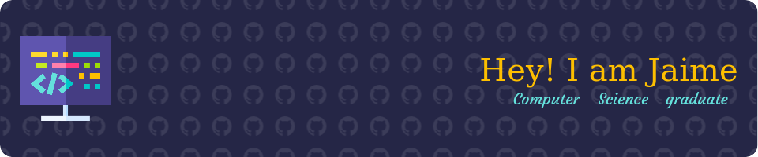

## About Me

👋 Hi there! I'm Jaime, a recent Computer Science graduate with a deep passion for programming and continuous learning. I thrive on solving complex problems and am constantly working on various projects to sharpen my skills and explore new technologies.

### 🚀 What I Do

- **Programming:** I have experience with multiple programming languages, including Kotlin, Java, Rust, and C++. I enjoy both frontend and backend development and have worked on several full-stack projects.
- **Android Programming:** In the last 2 years, I have been getting deep into Android programming. I've built and contributed to several Android applications, honing my skills in mobile app development. I've found in Android programming lots of great challenges that make me want to explore this world professionally.
- **Projects:** My GitHub repositories showcase some of the main projects I have worked on. I believe in learning by doing, and each project is an opportunity to explore new technologies and improve my coding skills.
- **Learning:** I'm a lifelong learner who is always looking for new challenges. Whether it's a new programming language, framework, or technology, I love diving in and learning all I can. Currently, I'm exploring CI/CD, Testing, Jetpack Compose Development and Linux ricing.
- 
### 🌟 Highlights

- **Projects:** 
  - **Salamandra:** A colaborative fully open source project, consisting of an Android applicattion, written in kotlin, using Jetpack Compose and a dedicated serverless backend written in rust using AWS cloud services to host it.
  - **Profinder:** An Anroid application presented as my final degree project at Universidad Complutense de Madrid (graded with an A), that helped me to sharpen my skills in Android development.
- **Skills:**
  - **Languages:** Kotlin, Java, Rust, C, C++, Lua.
  - **Tools:** Git, Docker, Neovim, Linux.

### 💡 Goals

- **Career:** I'm seeking opportunities to work on innovative projects where I can contribute, learn, and grow as a software developer. I'm particularly interested in finding a job as a Jetpack Compose developer or Kotlin Multiplatform mobile developer.
- **Community:** I believe in the power of collaboration, community and open source. I'm eager to connect with other developers, contribute to open-source projects, and participate in tech events.

### 📫 Get in Touch

- **Email:** [jaime.vazquez.martin2018@gmail.com](jaime.vazquez.martin2018@gmail.com)
- **LinkedIn:** [Link to my profile](https://www.linkedin.com/in/jaime-pablo-v%C3%A1zquez-mart%C3%ADn-a4a907255)

Feel free to explore my repositories and connect with me. Let's build something amazing together!
